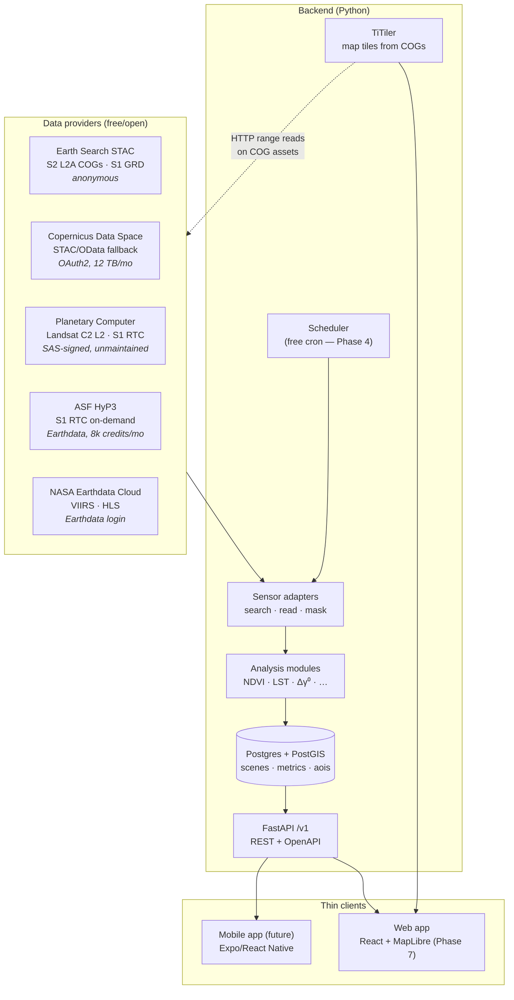

# System architecture (Phase 0)

One backend owns all logic. Clients are thin and interchangeable. Data flows in
one direction: catalogs → adapters → modules → database → API → clients.

## Component decisions

| Component | Choice | Why |
|---|---|---|
| API style | REST + OpenAPI 3.1, `/v1/` prefix | Spec is the single source of truth; typed clients generated for web *and* mobile from one file. GraphQL rejected: adds a second contract and a codegen burden a solo dev doesn't need. |
| Business logic | 100% in backend | Mobile future requirement. Clients render; they never compute metrics or talk to STAC catalogs. |
| Ingestion | Separate scheduled workers, never the web process | Satellite data is periodic, not streaming. Web stays fast; a hung catalog can't take the API down. |
| Raster access | Windowed HTTP range reads on COGs (rasterio + rio-tiler; odc-stac for multi-scene stacks) | Reads kilobytes of an AOI window, not 1 GB tiles. This is what makes $0 possible. (stackstac rejected — unmaintained since Aug 2024.) |
| Tiles | TiTiler, mounted in the same FastAPI deployable | On-the-fly tiles straight from provider COGs → zero tile storage. One process to host, not two. |
| Database | Postgres + PostGIS (decision deferred to Phase 3) | Multi-user web access rules out SQLite if the site ever opens; PostGIS is the AOI standard anyway. |
| Mobile path | Same `/v1` API + generated client | `/packages/shared` holds generated types; Expo app later consumes them unchanged. |
| Notifications | Channel-agnostic alert engine | Email + web push now; mobile push later — same rules, new channel adapter. |

## Design principles

1. **API-first**: nothing in the backend assumes a browser (no cookies-only
   auth, no HTML rendering, CORS configured explicitly).
2. **Pluggable at two seams**: `SensorAdapter` (data in) and
   `AnalysisModule` (metrics out). Adding a sensor or a metric never touches
   the API layer.
3. **Quality is first-class**: every metric carries `valid_pixel_pct`; every
   scene carries its quality mask provenance. A monitoring product that hides
   cloud contamination is worse than none.
4. **Attribution is a UI requirement**, not a footer afterthought — every
   source's license text appears where its data renders.
5. **One person can run it**: managed free tiers, no Kubernetes, no
   self-hosted object storage until forced.

## What this architecture deliberately does NOT have

- No raster database/tiling pipeline of our own (TiTiler reads providers' COGs).
- No message queue — cron + Postgres rows is enough at this scale.
- No object storage in v1 — thumbnails come from TiTiler preview endpoints.
  (R2 free tier is the escape hatch if we need persisted imagery.)
- No streaming/WebSockets — revisit cycles are days; polling on read is fine.
- No provider asset URLs in API responses — MPC SAS terms forbid sharing signed
  URLs with third parties. Clients get tiles and metrics; signed reads stay
  server-side.
